# Architecture

`sisuc` compiles one Sisu source file into one native executable. It is a
pipeline: each stage takes what the previous stage produced and hands on
something closer to machine code. The stages run in one process, with LLVM
linked in as a library. Only the final link runs a separate program, the
system C compiler `cc`.

<picture>
  <source media="(prefers-color-scheme: dark)" srcset="architecture/sisu-pipeline-dark.svg">
  
</picture>

This page stays at the level of stages and the data between them. The code
and its comments hold the detail, and [GLOSSARY.md](../GLOSSARY.md) defines
the terms.

## The stages

**Driver** (`crates/sisuc/src/main.rs`). Reads the command line, runs the
stages in order and prints diagnostics. The `--emit` and `--check` flags stop
the pipeline early, as [Developing Sisu](development.md#look-inside-the-compiler)
lists.

**Lexer** (`lexer.rs`). Turns source text into tokens. A line break that can
end a statement becomes a `Newline` token, because statements end at
newlines, not semicolons
([ADR 0001](adr/0001-newline-terminated-statements.md)). The lexer stops at
the first error.

**Parser** (`parser.rs`, `ast.rs`). Turns tokens into a syntax tree, the AST.
It also stops at the first error.

**Checker** (`check/`, `tir.rs`). Resolves every name, types every expression
and lowers sugar such as `while`. It reports every error in one run: an
expression that already failed gets the poison type, so one mistake produces
one diagnostic. A program with no errors comes out as the typed tree, `tir`,
which is all that codegen reads.

**Codegen** (`codegen.rs`). Walks `tir` and builds an LLVM module through the
[inkwell](https://github.com/TheDan64/inkwell) bindings. Each Sisu function
becomes an LLVM function named `sisu.<name>`, and a C `main` calls
`sisu.main`. Integer overflow and division by zero call `sisu_panic` instead
of wrapping ([ADR 0003](adr/0003-arithmetic-panics.md)).

**LLVM 22**. Runs the `mem2reg` pass, which turns stack slots into registers,
then emits x86-64 object code for the machine `sisuc` runs on.

**Link step** (`link.rs`). Writes the object code to a fresh temporary file
and runs `cc` on it together with `libsisu_runtime.a`. `cc` adds the C
startup code and libc and writes the executable. The temporary file is
removed whether or not the link succeeds.

**Runtime** (`crates/runtime`). A Rust static library with a C ABI, linked
into every program. Generated code calls it for what is easier to write in
Rust than to emit as IR: `sisu_print_int`, `sisu_print_bool` and
`sisu_panic`.

**Diagnostics** (`diagnostic.rs`). Every stage reports problems as
diagnostics, rendered in the style of `rustc`: the message, the
`file:line:col`, and the source line with the code underlined.

## Updating the diagram

The diagram's source is
[`architecture/sisu-pipeline.json`](architecture/sisu-pipeline.json), written
for the [archify](https://github.com/tt-a1i/archify) diagram tool. After a
change to the pipeline:

1. Edit the JSON.
2. Render it: `archify finalize architecture sisu-pipeline.json
   sisu-pipeline.html --quality showcase`.
3. Open the HTML, and save **Export → SVG · Light** and **Export → SVG ·
   Dark** over `sisu-pipeline-light.svg` and `sisu-pipeline-dark.svg`.

The rendered HTML is not committed. It is over the 500 KB limit of the
`check-added-large-files` hook, and the JSON regenerates it.
